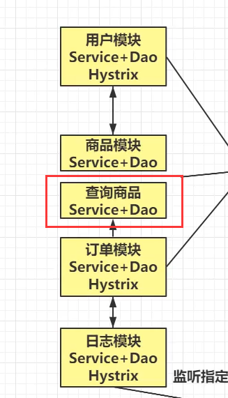

# 微服务架构演进示例 :see_no_evil:

## Tips 更多关于对系统演进的理解
*构建可靠的大型分布式系统
 [从架构演进、架构甚础、分布式甚石、基础没施、技术方法论五个维度，带你了解如何构建一套可靠的分布式大型软件系统](https://icyfenix.cn/introduction/about-book.html)*

**互联网架构演进**

**1.生产环境和开发环境**

**2.web1.0和web2.0**

2.1 web1.0时期用户量少，并发量小，单体结构能满足性能需求

2.2 web2.0时期，服务器集群

**2.3.如何解决集群之后出现的问题**

本质上，某个服务/应用单体性能出现瓶颈之后，套娃使用集群，使用集群需要解决如下共同的问题。

也叫中间件

**3.垂直架构**

水平架构  ---直接复制粘贴

垂直架构 ---先拆分成多分，再复制粘贴

for 单独对某个请求量大的模块进行分配多集群

**4.分布式架构**

水平架构集群增加服务数量，垂直架构细分模块，分布式架构模块之间需要通讯  RPC协议 Dubbo   HTTP feign

**5.分布式机构下的问题**

**5.1 服务间的异步通讯**

非核心业务，异步通讯减少相应系统响应时间

**5.2 服务之间通讯地址的维护**

Nginx是用户调用服务的负载均衡

robbin是服务之间的负载均衡

**5.3服务降级**

eruka(注册中心、网关)、ribbin（服务器间负载均衡）、hystrix都是spring cloud中的组件

nacos                          feign

**5.4海量数据**

海量数据会导致数据库无法存储全部的内容。

即便数据库可以存储海量的数据，在查询数据时，数据库的响应时及其缓慢的。

在用户高并发的情况下，数据库也时无法承受住的。

为了解决上述的问题，可以基于Mycat实现数据库的分库分表。

**6.微服务架构**

分布式架构下再分布式拆分一下，单个服务只做某件事情，如商品查询

**6.2 容器化技术**

**6.3 分布式架构下的其他问题**

分布式架构帮助我们解决了很多的问题，但是随之也带来了很多问题:

1.分布式事务:--seata

最传统的操作事务的方式，是通过connection链接对象的方式操作，Spring也提供了声明式事务的操作。

为了解决事务的问题,后续会使用到RabbitMQ | LCN方式来解决。

2，分布式锁:

传统的锁方式，synchronized | Lock锁，在分布式环境下，传统的锁是没有效果的。为了解决锁的问题,后续会使用到Redis | Zookeeper来解决。

3．分布式任务: --xxxJob,quartz

在传统的定时任务下，由于分布式环境的问题，可能会造成任务重复执行，一个比较大的任务，需要可以拆分。

分布式事务失效，同一功能，希望事务1，事务2都成功或者都失败

s

